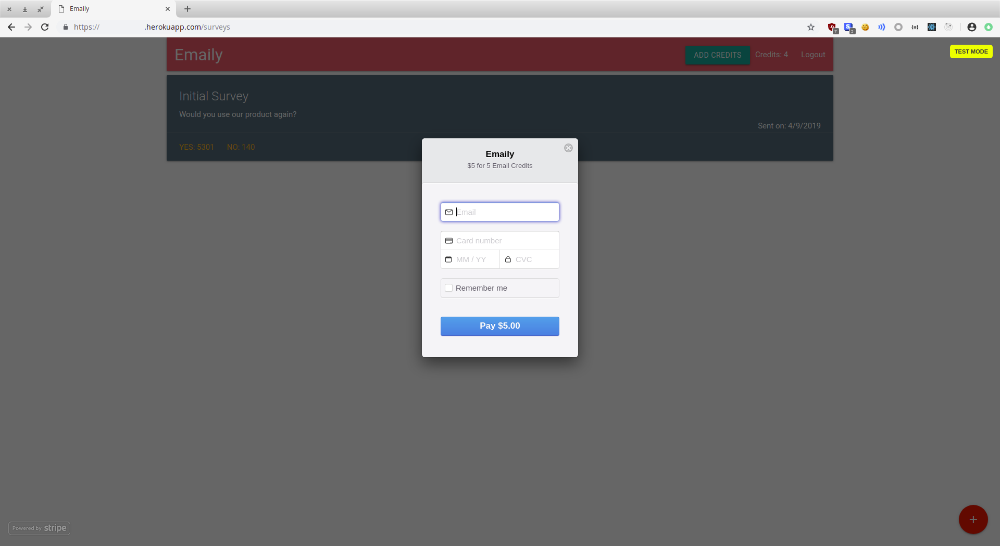

## Work from Udemy course "Node with React: Fullstack Web Development"

#### This repository hosts all my work from the various coding challenges and projects completed while taking this udemy course: https://www.udemy.com/node-with-react-fullstack-web-development/. 

#### Throughout the course you:

* Create boilerplate starter projects with React, Redux, Express and Mongo
* Master deployment techniques between the production and development environments
* Learn the architectural considerations of building a full stack app
* Connect a front-end Create-React-App server to a NodeJS and Express backend
* Communicate data from your Mongo database to your React application
* Understand how to route user requests on the front end with React Router and on the backend with Express
* Build reusable user inputs with Redux Form, complete with navigation
* Handle credit cards and receive payments from your users with Stripe
* Engage your users with automated emails
* Enhance authentication flows in your app with Google OAuth authentication
* Separate production and development resources with advanced API key handling techniques
* Educate your users on how to use your app with custom build landing pages

...and much more!

#### It's a great course and I highly recommend it!

### Below is a screenshot of the project you build throughout the course. It's light on styling but absolutely packed with functionality!

#### The React frontend dashboard can be seen in the background pulling surveys out of our MongoDB backend for display to the user. The modal is the integrated Stripe feature used to buy 'credits' for survey purchasing. The user has authn'd via Google OAuth.

